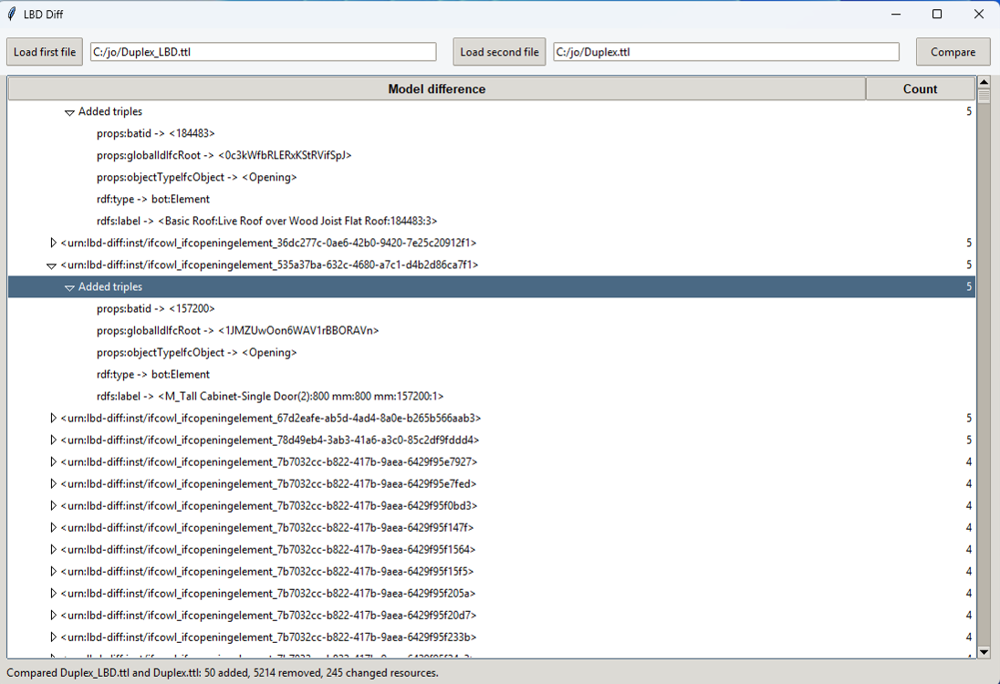

# LBD Diff

LBD Diff is a small Python desktop application for comparing two Linked Building Data Turtle files.


It loads two `.ttl` files, parses them as RDF graphs, and presents the model differences in a tree view:

- resources only in the first file
- resources only in the second file
- resources present in both files with changed triples
- added and removed predicate/object values for each changed resource

## Requirements

- Python 3.10 or newer
- Tkinter, usually included with Python desktop installs
- `rdflib`

Install the Python dependency:

```bash
python3 -m pip install -r requirements.txt
```

## Run

From this folder:

```bash
python3 -m lbd_diff
```

Or from the repository root:

```bash
python3 -m LBD_Diff.lbd_diff
```

## Test

```bash
python3 -m unittest discover -s tests
```

## Example Files

Two tiny sample Turtle files are included in `examples/` so the UI can be tried without external data.
